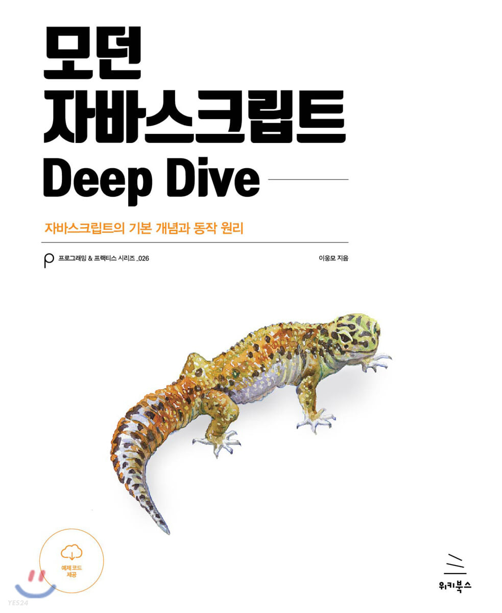

# ModernJSDeepDive

모던 자바스크립트 딥 다이브 스터디

<aside>
📢 진행방식: 한 사람씩 돌아가면서 세션 자료 준비 및 스피치!

- 본격적으로 세션 시작하기 전 미리미리 준비하기
- 세션 담당자가 아닌 사람은 각자 노션이나 블로그에 정리하면서 공부해오기

**스터디내용**: 자바스크립트 기초부터 심화까지

**일시 및 장소:** 매주 수요일 저녁 7시 ~ 10시 도서관 스터디룸

**기간**: 겨울방학 (~2월)

**교재**: **모던 자바스크립트 Deep Dive**

</aside>

| 주차 (날짜) | 내용                                                                          | 발표자 |
| ----------- | ----------------------------------------------------------------------------- | ------ |
| 1주차(1/4)  | 변수, 표현식과 문, 데이터타입, 연산자, 제어문, 타입변환과 단축평가 (ch4~9)   | 나예   |
| 1주차(1/4)  | 객체 리터럴, 원시 값과 객체의 비교, 함수 (ch10~ch12)                          | 동길   |
| 2주차(1/11) | 스코프, 전역변수의 문제점, let, const 키워드와 블록 레벨 스코프 (ch13~15) | 하린   |
| 2주차(1/11) | 프로퍼티 어트리뷰트, 생성자 함수에 의한 객체 생성 (ch16~17)        | 선영   |
| 3주차(1/18) | 함수와 일급 객체, 프로토타입 (ch18~19)      | 동길  |
| 3주차(1/18) | strict mode, 빌트인 객체, this (ch20~22)        | 나예   |
| 4주차(1/25) | 설 연 휴 | Happy |
| 5주차(2/1) | 실행 컨텍스트, 클로저 (ch23~ch24)        | 하린   |
| 5주차(2/1) | 클래스, ES6 함수의 추가 기능 (ch25~26)        | 선영   |
